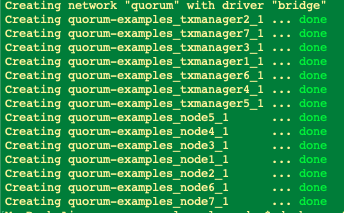

### Connecting Epirus to Quorum 7 Node Example 

##### Requirements 

1. Docker Compose


Get Epirus 

>git clone https://github.com/blk-io/epirus-free.git


Get Quorum 7 node example 

> git clone https://github.com/jpmorganchase/quorum-examples


#### Set up Epirus

Navigate to the directory Epirus was cloned and open the `docker-compose.yml` file.

Create a custom network as such:

```json
networks:
  epirus:
    name: quorum
    driver: bridge
    ipam:
      driver: default
      config:
      - subnet: 172.16.239.0/24
```

Make sure that each Epirus service has the following network declaration:

```json
networks:
	- epirus
```

#### Set up 7 Node Example

Navigate to the directory Quorum 7 Node Example was cloned and open the `docker-compose.yml` file

Add the following property to `quorum-examples-net ` in the networks settings:

```json
name: quorum
```

#### Starting the services 

- Quorum 7 Node Example

Open the terminal or navigate to the location of  Quorum 7 Node Example. Once you are in the same directory as the docker-compose file execute the following line in your terminal:

`docker-compose up -d`



You should see the following happening in the terminal window. This means that everything has started successfully.

Open the terminal or navigate to the location of Epirus. Once you are in the same directory as the docker-compose file execute the following line in your terminal:

`NODE_ENDPOINT=http://172.16.239.11:8545/ docker-compose up -d`


> Note: If you want to check the progress in more detail you could run the following line in your terminal after you have succesfully started Epirus: 
>
> `docker-compose logs -f api`

You should see the following happening in the terminal window. This means that everything has started successfully.

Navigate to [localhost](http://localhost) and you should see the following:


After a few minutes Epirus should display the following information:


Epirus has succesfully connected to the Quorum 7 Node Blockchain.

To close Epirus or Quorum 7 Node example you can execute the following line in your terminal:

`docker-compose down` 

Make sure you are in the same directory as the compose file.

#### Help & Additional Information

For more information on Epirus you can go [here](https://github.com/blk-io/epirus-free).

For more information Quorum 7 Nodes example you can go [here](https://github.com/jpmorganchase/quorum-examples/blob/master/README.md).

