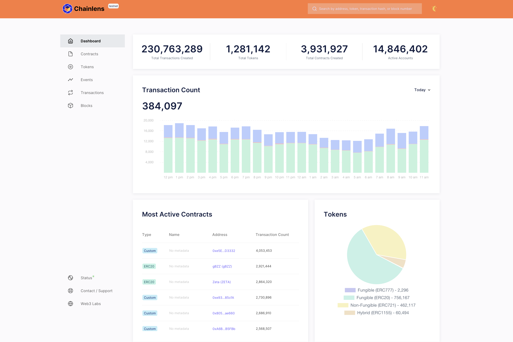

# Chainlens

Blockchain Explorer for Besu, Quorum and Ethereum-compatible blockchains

## Introduction

Chainlens is a data and analytics platform for Ethereum-compatible blockchains.

It provides a rich API, and easy-to-use interface to provide information on the various assets such as tokens, and smart contracts deployed on blockchains.

A free developer edition is available in this repo, we also provide hosted plans for it. They are outlined below.

## Free plan

This distribution of Chainlens is a free version designed for viewing public and private Ethereum networks. It supports  
[Quorum](https://github.com/ConsenSys/quorum), [Hyperledger Besu](https://besu.hyperledger.org/en/stable/) and [Ethereum](https://github.com/ethereum/go-ethereum) networks.

## Hosted plans

Web3 Labs provides hosted plans that provide additional functionality including:

- Custom branding and hosting at a custom domain
- Dedicated views of tokens
- Smart contract management and source code upload
- OpenAPI back-end
- Integrations with business intelligence tools such as Tableau Microsoft PowerBI and Qlik
- Production SLAs
- Large transaction volumes (100,000,000+)

The advantage of the hosted plan is that all you need to provide is a compatible web3 client endpoint, and we will do the rest.

You can view more information on these plans [here](https://chainlens.com), or contact Web3 Labs directly via [hi@web3labs.com](mailto:hi@web3labs.com?subject=Chainlens%20hosted%20plans).

### Deployment instructions

This repo contains configuration to run the free version using either Docker Compose or Kubernetes.

Follow the appropriate guide to run Chainlens locally against an Ethereum, Quorum or Hyperledger Besu networks.

- [Docker Compose deployment](docker-compose/README.md)
- [Kubernetes deployment](k8s/README.md)

### System Requirements

Recommended minimum system requirements.

| Components | Description |
|-----------|-------------|
|  CPUs        | 1 CPU |
|  Memory      | 8 GB |
|  Disk        | Proportional to the blockchain size |

## License

Chainlens is free for non-commercial use and evaluation purposes only, for further details refer to the [LICENSE](LICENSE). To speak to use about commercial use you can email us via `hi <at> web3labs.com` or submit an enquiry [here][([[https://pages.web3labs.com/sirato-enterprise](https://chainlens.com/contact/)](https://chainlens.com/contact/).

