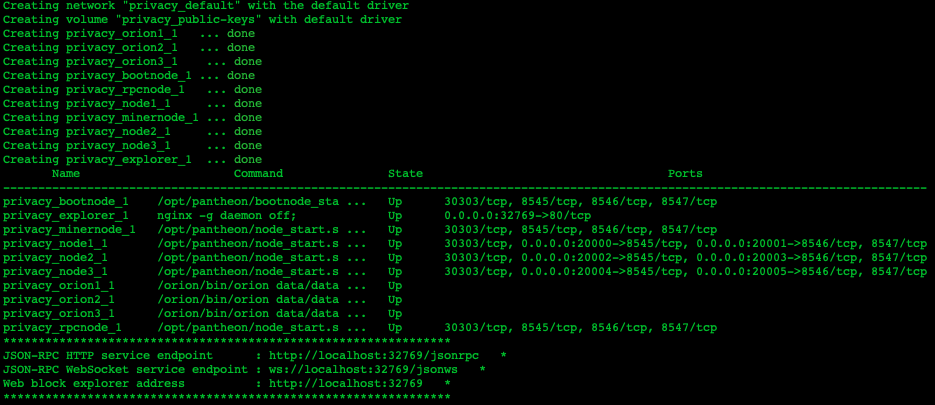

### Connecting Epirus to Pantheon-quickstart Privacy Node

Get Pantheon Quickstart

```
git clone https://github.com/PegaSysEng/pantheon-quickstart.git
cd pantheon-quickstart
cd privacy
./run.sh
```

You should see the following happening in the terminal window.




#### Set up Epirus-Free

```
git clone https://github.com/blk-io/epirus-free.git
cd epirus-free
```

You need to make some minor changes to the `docker-compose.yml` file so that epirus can connect to a running node.

Change the networks `name` property from `epirus-net` to `privacy_default` in the networks settings:

`sed -i 's/name: epirus-net/name: privacy_default/g' docker-compose.yml`

and the subnet to `172.19.0.0/16`.


The networks property should now looks like this:

```json
networks:
  epirus:
    name: privacy_default
    driver: bridge
    ipam:
      driver: default
      config:
        - subnet: 172.19.0.0/16
```

Now you can start epirus with the following command. 

`NODE_ENDPOINT=http://172.19.0.6:8545/ docker-compose up`

> Note: we are connecting to node 1 - you will only see private transactions for that node.

You should see the following happening in the terminal window. This means that everything has started successfully.


> Note: The logs are verbose and you will see various errors before all services are started. The important logs to look at are on the api. You can access them with the following
> 
>`docker-compose logs -f api`


Navigate to [localhost](http://localhost) and you should see the loading page:


After a few minutes Epirus should display the following information:


Epirus has successfully connected to a Pantheon node and is ingesting data. Depending on your machine specs this can take a long time to get to this point (20 mins on a macbook air).

To close Epirus you can execute the following line in your terminal:

`docker-compose down` 

To close Pantheon you can execute the following line in your terminal:
```
./stop.sh
./remove.sh
```


#### Help & Additional Information

For more information on Epirus you can go [here](https://github.com/blk-io/epirus-free).

For more information Pantheon-quickstart 7 example you can go [here](https://github.com/PegaSysEng/pantheon-quickstart).

