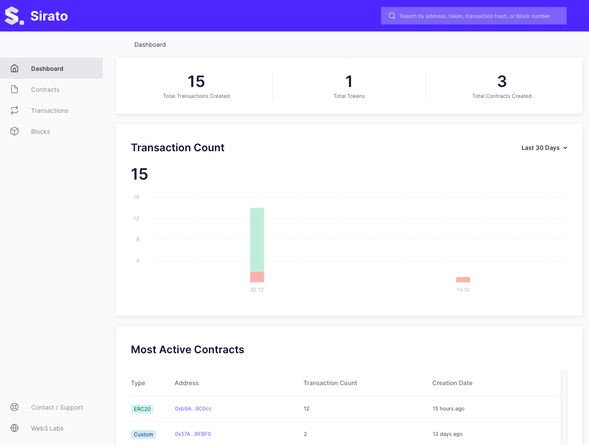

# Kubernetes deployment scripts

You can use the script contained in this directory to generate and run Chainlens using Kubernetes.

## Starting Chainlens

If you are running locally, you should first start minikube, then run the following script:

```
./chainlens-launch.sh http://<rpc-endpoint-ip>:<rpc-endpoint-port-number> 
```

Note: Port number is 8545 by default

You can verify the status of Chainlens by running:

```
kubectl get pods -n chainlens-explorer
```

Once all pods are available, proceed to the next step.

## Start Proxy (If running local minikube)

Ensure minikube ingress is enabled, issuing the following command

```
minikube addons enable ingress
```

Start proxy service, issuing the following command

```
minikube service chainlens-proxy -n chainlens-explorer
```

```
❯ minikube service chainlens-proxy
|-----------|--------------|-------------|---------------------------|
| NAMESPACE |     NAME     | TARGET PORT |            URL            |
|-----------|--------------|-------------|---------------------------|
| default   |chainlens-proxy|         80 | http://192.168.49.2:31969 |
|-----------|--------------|-------------|---------------------------|
🏃  Starting tunnel for service chainlens-proxy.
|-----------|--------------|-------------|------------------------|
| NAMESPACE |     NAME     | TARGET PORT |          URL           |
|-----------|--------------|-------------|------------------------|
| default   | chainlens-proxy |          | http://127.0.0.1:56439 |
|-----------|--------------|-------------|------------------------|
🎉  Opening service default/chainlens-proxy in default browser...
```

Point your browser to the provided URL.

**Note** it can take a while for the Chainlens dashboard to appear (5-10 minutes). Please refresh your page if you encounter an Nginx error page.



## Stopping Chainlens

To stop Chainlens and cleanup all components, run:

```
./chainlens-destroy.sh
```
